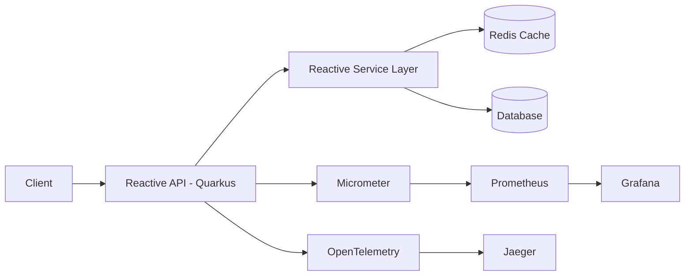

# ⚡ Modern Reactive Java Backend


---

## 🚀 Overview

Backend moderno em **Java** construído com **Quarkus**, focado em:

- Programação reativa ponta a ponta
- Operações assíncronas com Mutiny
- Cache distribuído com Redis
- Geração de imagens nativas com GraalVM
- Observabilidade completa (metrics, tracing, profiling)
- Estratégias para ambientes de produção

Projeto estruturado com foco em **performance, escalabilidade e monitoramento avançado**.

---

## 🏗 Arquitetura



---

## ⚙️ Stack Tecnológica

- Java 25
- Quarkus
- Mutiny (Reactive Programming)
- Redis
- GraalVM Native Image
- Micrometer
- Prometheus
- Grafana
- OpenTelemetry
- Jaeger
- VisualVM
- Java Flight Recorder

---

## 🔄 Programação Reativa

- Fluxos assíncronos com Mutiny
- Tratamento de exceções reativas
- Reatividade ponta a ponta
- Otimização da experiência do usuário com processamento não bloqueante

---

## 🧠 Estratégias de Cache

- Integração Redis com Quarkus
- Estratégias de invalidação
- Cache para dados temporários
- Redução de latência e aumento de throughput

---

## 🚀 Native Image com GraalVM

- Conversão para imagem nativa
- Startup ultrarrápido
- Redução de consumo de memória
- Otimização para ambientes cloud e containers

---

## 📊 Observabilidade

### 🔎 Métricas
- Micrometer
- Exposição para Prometheus
- Dashboards com Grafana

### 🔍 Tracing Distribuído
- OpenTelemetry
- Jaeger
- Spans personalizados
- Análise de gargalos

### 📈 Profiling
- VisualVM
- Java Flight Recorder
- Diagnóstico de gargalos
- Identificação de deadlocks

---

## 🌐 Estratégias para Produção

- Migração segura para ambientes produtivos
- Monitoramento contínuo
- Diagnóstico de performance
- Escalabilidade baseada em métricas

---

## ▶️ Execução

### Dev Mode

```bash
./mvnw quarkus:dev
```

### Build

```bash
./mvnw package
```

### Native Build

```bash
./mvnw package -Pnative
```

---

## 📌 Principais Capacidades Demonstradas

✔ Backend reativo moderno  
✔ Operações não bloqueantes  
✔ Cache distribuído  
✔ Imagens nativas  
✔ Observabilidade completa  
✔ Profiling avançado  
✔ Performance otimizada  

---

## 👨‍💻 Author

**Rafael Junio Moraes**  
GitHub: https://github.com/Rafael01Gx  
Java Backend Engineer | Reactive Systems | Observability
